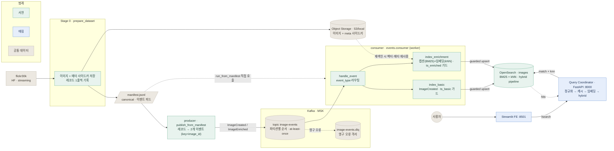
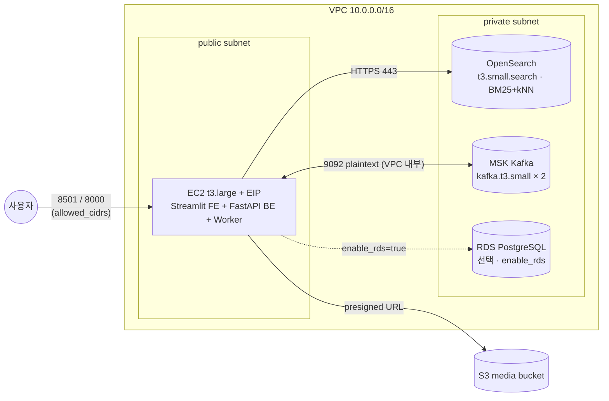

# Hybrid Search System

이미지 캡션에 대한 **하이브리드 검색**(BM25 키워드 + kNN 시맨틱) 시스템. flickr30k를
받아 이미지는 오브젝트 스토리지(**실제 백엔드는 S3**)에 저장하고, 캡션은 OpenSearch에
색인해 키워드 + 의미 기반 검색을 함께 제공한다. 로컬 디렉터리 백엔드는 **테스트용**으로,
S3 없이 같은 파이프라인을 돌려보기 위한 대체물이다.

## 아키텍처 / 데이터 흐름



- **스토리지가 source of truth.** 이미지 옆에 메타데이터 JSON(사이드카)을 같이 저장하고,
  색인 단계에서 임베딩 벡터를 사이드카에 되써 넣는다. 그래서 인덱스가 날아가도 스토리지만으로
  재색인할 수 있고, 비싼 임베딩 모델을 다시 돌릴 필요가 없다.
- **이벤트 구동 색인.** 두 서비스(업로드/캡셔닝)가 발행하는 `ImageCreated`/`ImageEnriched`를
  단일 토픽 `image-events`(key=`image_id`)로 흘려보내고, consumer 워커가 색인한다. 오프셋은
  OpenSearch upsert 성공 후 수동 커밋(at-least-once) → 크래시 시 재처리되지만 아래 가드가 흡수한다.
- **phase별 stale-overwrite 가드.** 두 phase는 서로 겹치지 않는 필드 + 각자의 타임스탬프
  (`ts_basic`/`ts_enriched` = 이벤트 `occurred_at`)만 쓴다. 순서가 뒤바뀌어도 손실이 없고,
  같은 phase의 오래된 재전달(`ts < 저장값`)은 `ctx.op='noop'`으로 버린다 (`index/worker.py`).
- **Kafka 없이 직접 색인**도 가능: `run_from_manifest`가 같은 두 함수를 순차 호출한다(개발/백필용).
- `manifest`는 항상 로컬 파일(스토리지 백엔드와 무관). 이미지/사이드카만 백엔드로 나간다.

## 프로젝트 구조

```
hybridsearch/
  config.py                  중앙 설정 (전부 환경변수로 override 가능, .env 자동 로드)
  storage.py                 ObjectStorage 추상 + LocalStorage / S3Storage + get_storage()
  embedding.py               all-MiniLM-L6-v2 (384d, 정규화)
  ingest/
    prepare_dataset.py       Stage 0: 데이터셋 → 스토리지 + manifest
  search/
    client.py                OpenSearch 클라이언트 팩토리
    index.py                 인덱스 매핑(text + knn_vector) + 하이브리드 search pipeline
  index/
    worker.py                index_basic / index_enrichment + handle_event (phase별 가드 upsert)
    run_from_manifest.py     manifest → OpenSearch 직접 색인 드라이버 (Kafka 우회)
  events/
    schema.py                이벤트 봉투 + 타입(ImageCreated/Enriched) + 검증
    producer.py              Kafka 프로듀서 (key=image_id)
    consumer.py              consumer 워커: image-events → 색인, 수동 커밋, 재시도/DLQ
    publish_from_manifest.py manifest → Kafka 이벤트 리플레이 (프로듀서 데모)
    admin.py                 토픽 + DLQ 생성 (멱등)
main.py                      Query Coordinator (FastAPI): 정규화→캐시→임베딩→hybrid 쿼리→매핑
streamlit_app.py             Streamlit FE (8501): 검색창 + 결과 그리드, 코디네이터 /search만 호출
docker-compose.yml           app(FastAPI 8000) + fe(Streamlit 8501) — .env 로 Managed OpenSearch + S3 연결
```

> 개발용 AWS 인프라(Terraform)는 별도 레포에 있다 →
> [aerim-choi/hybrid-search-system-terraform](https://github.com/aerim-choi/hybrid-search-system-terraform). 아래 "개발용 인프라" 참고.

## 사전 준비

```bash
# 의존성 설치 (uv 사용)
uv sync
```

## 사용법

### 1) OpenSearch 연결 (AWS Managed)

색인·검색은 `.env`가 가리키는 AWS Managed OpenSearch 도메인에 붙는다(로컬 도커
OpenSearch는 없음). 도메인이 VPC 전용이라 **VPC 안(EC2 등)에서 실행**해야 닿는다.

```bash
# .env 에 OPENSEARCH_HOST / OPENSEARCH_AUTH 설정 후, VPC 안에서 준비 확인
curl -s "https://${OPENSEARCH_HOST}/_cluster/health"   # status: green/yellow 면 OK
```

### 2) 데이터 준비 (Stage 0)

```bash
# 작은 수량으로 로컬 테스트 — data/images/ 에 떨어짐 (S3 안 씀)
HS_STORAGE_BACKEND=local uv run python -m hybridsearch.ingest.prepare_dataset --limit 50

# 실제 적재 (S3) — .env의 HS_S3_BUCKET 이 가리키는 버킷으로 업로드, 기본 10,000장
uv run python -m hybridsearch.ingest.prepare_dataset --limit 10000
```

- `--limit`은 "manifest 총량 목표"라 **재실행하면 이어받기**(resumable)된다. 캡션 없는 행은 건너뛴다.
- flickr30k(`test` split)는 총 약 **31,783장**이 상한. parquet에 이미지 바이너리가 들어 있어
  streaming이어도 받는 데이터량이 적지 않다(1만 장 ≈ 수 GB).

### 3) OpenSearch 색인 (Stage 1)

```bash
# 인덱스 + 하이브리드 파이프라인 생성 후, manifest 전체 색인
uv run python -m hybridsearch.index.run_from_manifest --recreate

# 인덱스를 지우지 않고 추가 색인만
uv run python -m hybridsearch.index.run_from_manifest
```

- 사이드카에 `caption_vector`가 이미 있으면 **재임베딩 없이 재사용**한다(모델 재실행 불필요).
- 인덱스 매핑/파이프라인만 따로 만들고 싶으면:
  `uv run python -m hybridsearch.search.index --recreate`
- **색인은 멱등하다.** `image_id` 기준 upsert(`doc_as_upsert`)라 재실행해도 중복이 안 생기고,
  `--recreate`로 인덱스를 날려도 manifest + S3 사이드카로 똑같이 복구된다. 실수해도 다시 돌리면 됨.

> **본 색인 전 드라이런 (권장):** EC2(VPC 안)에서 도커로 돌릴 때는 `./run.sh smoke`로 전체
> 경로(manifest → S3 사이드카 → 임베딩 → OpenSearch)를 소량으로 먼저 검증한다. 버려도 되는
> 인덱스(`images_smoke`)에 앞 `SMOKE_N`(기본 20)건만 색인했다가 지우므로 **실제 `images`
> 인덱스는 건드리지 않는다.** 컨테이너 안 IMDS 자격증명(S3)과 OpenSearch 연결을 한 번에 확인하는 용도.
>
> ```bash
> ./run.sh up && ./run.sh smoke      # 통과하면:
> ./run.sh index --recreate
> ```

### 3-K) 이벤트 구동 색인 (Kafka)

운영 경로는 위의 직접 색인 대신 Kafka를 거친다. `publish_from_manifest`(프로듀서)가 레코드를
`ImageCreated`/`ImageEnriched` 두 이벤트로 쪼개 `image-events`(key=`image_id`)에 발행하고,
consumer 워커가 소비해 색인한다. (`.env`의 `HS_KAFKA_BOOTSTRAP` 필요, VPC 안에서 실행)

```bash
./run.sh kafka-init                 # 토픽 image-events + DLQ 생성 (1회)
./run.sh up                         # API + FE + consumer 워커 기동 (워커가 상시 소비)
./run.sh publish --limit 50         # manifest 50건 -> 100개 이벤트 발행
./run.sh logs worker                # 워커 색인 로그 확인
```

도커 없이 직접 실행할 때 (워커는 `run-event.sh`로 — 아래 *4-R* 참고):
```bash
uv run python -m hybridsearch.events.admin                            # 토픽 생성
./run-event.sh bare                                                   # 워커 상시 (pid→.run, 로그→logs)
uv run python -m hybridsearch.events.publish_from_manifest --limit 50
```

- **at-least-once + 멱등.** 오프셋은 OpenSearch upsert 성공 후 커밋 → 재처리(중복)는 phase별 ts 가드가 흡수.
- **순서.** key=`image_id`라 한 이미지의 1·2차가 같은 파티션에 순서대로 적재된다(토픽을 쪼개면 깨짐).
- **DLQ.** 스키마 불일치·알 수 없는 타입 등 영구 오류는 `image-events.dlq`로 분리. transient(OpenSearch 5xx/연결)만 백오프 재시도.
- **확장.** `docker compose up -d --scale worker=2`로 파티션 수까지 워커를 수평 확장.

### 4) 검색: Query Coordinator(FastAPI) + Streamlit FE

`./run.sh up`이 두 컨테이너를 같이 띄운다 — **app**(코디네이터, 8000)과 **fe**(Streamlit, 8501).

```bash
./run.sh up                       # app(8000) + fe(8501) 기동
# 브라우저로 http://localhost:8501 → 검색창에 키워드 입력
./run.sh search "two dogs playing on the beach"   # CLI로 직접 호출 (curl)
```

흐름: **Streamlit(8501) → 코디네이터 `/search`(8000) → OpenSearch hybrid + `hybrid-pipeline`**.
코디네이터는 요청마다 `q 정규화 → 결과캐시 조회 → (캐시미스면) 워커와 동일한 MiniLM으로 q 임베딩
→ hybrid 쿼리(match on `description` + knn on `caption_vector`) → hits를 `{image_url, description, score}`로 매핑`을 한다.

- **임베딩 일관성**: 코디네이터의 임베딩 모델·정규화(`normalize_embeddings=True`)가 색인 워커와
  100% 동일해야 벡터 공간이 일치한다(`hybridsearch/embedding.py` 공유). 어긋나면 kNN이 무의미해진다.
- **모델 warm-load**: 코디네이터 기동 시 1회 로드. 요청마다 재로딩하지 않는다.
- **캐시**: 정규화한 `(q, k, weights)`로 결과 LRU + `q→임베딩` LRU(재인코딩 회피). 10K 규모는 인메모리로 충분,
  확장 시 Redis로 교체.
- **가중치 조정(옵션)**: FE 사이드바에서 BM25/시맨틱 가중치를 켜면 `/search?w_bm25=..&w_knn=..`로
  전달되고, 코디네이터가 해당 가중치로 **인라인 파이프라인**을 만들어 검색한다(명시 안 하면 명명 파이프라인 사용).
- **enriched 안 된 문서**는 `caption_vector`가 없어 kNN에 자동으로 안 잡힌다.

> API+FE를 `run.sh`(compose 전체) 없이 따로 띄우려면 아래 *4-R*의 `run-fe.sh`를 쓴다.
> (FE는 `HS_API_URL`이 가리키는 코디네이터를 호출 — bare면 기본 `http://localhost:8000`)

### 4-R) 앱 실행 스크립트 — `run-event.sh` / `run-fe.sh`

`run.sh`는 데이터 업로드/색인 전용이고, **앱 실행은 두 스크립트로 분리**돼 있다. 각각 `docker`(compose)와
`bare`(도커 없이 호스트 프로세스, uv) 모드를 지원한다. bare 모드는 pid를 `.run/`, 로그를 `logs/`에 쓴다(둘 다 gitignore).

| 스크립트 | 대상 | `docker` | `bare` |
|----------|------|----------|--------|
| `run-event.sh` | Kafka consumer 워커 | `docker compose up -d worker` | `python -m hybridsearch.events.consumer` |
| `run-fe.sh` | API(8000) + Streamlit(8501) | `docker compose up -d app fe` | `uvicorn` + `streamlit` |

```bash
./run-event.sh docker|bare        # 워커 기동
./run-fe.sh    docker|bare        # API + FE 기동
./run-event.sh down [docker|bare] # 종료 (생략 시 양쪽 다 정리)
./run-fe.sh    logs [docker|bare] # 로그 tail (기본 docker)
```

**실행 순서** (이벤트 구동 색인 기준, Managed OpenSearch/S3/MSK는 이미 떠 있다고 가정):

```bash
./run.sh kafka-init           # 1) 토픽 생성 (최초 1회)
./run-event.sh bare           # 2) 워커 먼저 (publish 이벤트를 소비해야 하므로)
./run.sh publish --limit 50   # 3) manifest → Kafka → 워커가 OpenSearch에 색인
./run-fe.sh bare              # 4) API + FE 기동
curl -s localhost:8000/health # 5) 확인 → 브라우저로 http://<host>:8501
```

- worker(2)를 publish(3)보다 먼저 띄운다. consumer group이라 늦게 떠도 따라잡지만, 먼저 올리는 게 안전.
- **FE와 API는 같은 모드로 묶어서 띄운다**: docker FE는 `HS_API_URL=http://app:8000`(compose 네트워크), bare FE는 `localhost:8000`을 본다. `run-fe.sh`가 둘을 한 번에 띄우므로 모드만 맞추면 된다.
- docker/bare 혼용도 가능하다(예: 워커는 `docker`, FE는 `bare`).
- Kafka 없이 **직접 색인**만 할 거면 1~3을 `./run.sh index --recreate`로 대체하고 워커는 생략한다.

### 5) 이미지 확인용 정적 서버 (local 백엔드일 때)

```bash
python -m http.server 8000 -d ./data/images   # image_url = http://localhost:8000/images/<key>
```

## 스토리지 백엔드

| 백엔드 | 용도 | 이미지/사이드카 저장 위치 | 설정 |
|--------|------|---------------------------|------|
| `s3` | **실제 적재** | `s3://<bucket>/images/{id}.jpg` + `meta/{id}.json` | `HS_STORAGE_BACKEND=s3` + 아래 S3 변수 |
| `local` | **테스트용** | `data/images/{id}.jpg` + `{id}.json` | `HS_STORAGE_BACKEND=local` |

로컬 디렉터리는 S3 없이 파이프라인을 돌려보기 위한 대체물이다. 두 백엔드는 동일한
`ObjectStorage` 인터페이스라 호출부 코드는 그대로고, 백엔드만 바꾸면 된다.

> ⚠️ **주의:** S3 백엔드는 `prepare`가 **실제 S3 버킷에 업로드**한다. `.env`의
> `HS_S3_BUCKET`이 올바른 버킷을 가리키는지 먼저 확인할 것. 빠르게 동작만 확인할 때는
> S3를 건드리지 않도록 `HS_STORAGE_BACKEND=local`을 명시하는 게 안전하다.

## OpenSearch 연결 (`OPENSEARCH_AUTH`)

`get_client()`가 `OPENSEARCH_AUTH` 값에 따라 접속/인증 방식을 고른다. 색인·검색 코드는
그대로고 **이 설정만 바꾸면 로컬 도커 ↔ AWS Managed OpenSearch로 전환**된다.

| 모드 | 용도 | 연결 | 인증 |
|------|------|------|------|
| `basic` | **AWS Managed (운영)** | HTTPS:443 | 마스터 유저 ID/PW (FGAC) |
| `iam` | AWS Managed (대안) | HTTPS:443 | AWS SigV4 서명 (비번 없음, EC2 롤 등) |
| `local` (기본) | 직접 띄운 OpenSearch / 개방형 도메인 / SSM 터널 | http:9200 또는 https | 인증 무시(보안 비활성·개방형) |

### AWS Managed 연결 (basic) — `.env`

```dotenv
OPENSEARCH_AUTH=basic
OPENSEARCH_HOST=search-xxxxx.ap-northeast-2.es.amazonaws.com   # https:// 빼고 호스트만
OPENSEARCH_PORT=443                                            # ⚠️ 필수: 기본값 9200 아님
OPENSEARCH_USER=<master-user>
OPENSEARCH_PASSWORD=<master-password>
```

> `basic`/`iam` 모두 HTTPS라 **포트를 443으로 둬야 한다**(기본값 9200은 로컬 도커용).
> 자격증명은 코드에 두지 말고 `.env`(git 미추적) 또는 시크릿으로 주입할 것.
>
> `iam` 방식은 비밀번호 없이 SigV4로 서명한다. 대신 EC2 인스턴스 롤에 `es:ESHttp*` 권한 +
> 도메인 액세스 정책이 필요하고, `.env`는 `OPENSEARCH_AUTH=iam` + `OPENSEARCH_HOST` +
> `AWS_REGION`만 있으면 된다(Serverless는 `OPENSEARCH_AWS_SERVICE=aoss`).

## 설정 (환경변수)

`hybridsearch/config.py`의 모든 값은 환경변수로 덮어쓸 수 있고, 루트 `.env`가 있으면 자동
로드된다(이미 셸에 설정된 실제 환경변수가 `.env`보다 우선).

| 변수 | 기본값 | 설명 |
|------|--------|------|
| `HS_STORAGE_BACKEND` | `local` | `local` / `s3` |
| `HS_DATA_DIR` | `./data` | 데이터 루트 |
| `HS_IMAGES_DIR` | `./data/images` | local 백엔드 이미지 디렉터리 |
| `HS_MANIFEST_PATH` | `./data/manifest.jsonl` | manifest 경로 (항상 로컬) |
| `HS_STORAGE_BASE_URL` | `http://localhost:8000/images` | local 서빙 주소 / S3는 비워두면 자동 유도 |
| `HS_S3_BUCKET` | (빈값) | S3 버킷명 |
| `AWS_REGION` | `ap-northeast-2` | S3 / SigV4 리전 |
| `AWS_ACCESS_KEY_ID` | (빈값) | IAM 액세스 키. 비우면 boto3 기본 체인(`~/.aws` / EC2 롤) 사용 |
| `AWS_SECRET_ACCESS_KEY` | (빈값) | IAM 시크릿 키. `AWS_ACCESS_KEY_ID`와 한 쌍 |
| `AWS_SESSION_TOKEN` | (빈값) | 임시(STS) 자격증명일 때만 |
| `HS_S3_IMAGE_PREFIX` | `images` | S3 이미지 키 prefix |
| `HS_S3_META_PREFIX` | `meta` | S3 메타데이터 키 prefix |
| `HS_DATASET_NAME` | `lmms-lab/flickr30k` | HF 데이터셋 (parquet 미러) |
| `HS_DATASET_SPLIT` | `test` | flickr30k는 전체가 `test`에 있음 |
| `HS_DEFAULT_LIMIT` | `10000` | `--limit` 기본값 |
| `OPENSEARCH_AUTH` | `local` | 접속/인증 방식: `local` / `basic` / `iam` (위 "OpenSearch 연결" 참고) |
| `OPENSEARCH_HOST` / `OPENSEARCH_PORT` | `localhost` / `9200` | OpenSearch 접속 (AWS Managed는 도메인 + `443`) |
| `OPENSEARCH_USER` / `OPENSEARCH_PASSWORD` | `admin` / `admin` | `basic` 모드 인증 (FGAC 마스터 유저) |
| `OPENSEARCH_USE_SSL` | `false` | `local` 모드의 SSL 여부 (`basic`/`iam`은 항상 HTTPS) |
| `OPENSEARCH_AWS_SERVICE` | `es` | `iam` 모드 SigV4 서비스명 (Serverless는 `aoss`) |
| `HS_INDEX_NAME` | `images` | 인덱스 이름 |
| `HS_SEARCH_PIPELINE` | `hybrid-pipeline` | 하이브리드 search pipeline 이름 |
| `HS_KAFKA_BOOTSTRAP` | (빈값) | MSK 부트스트랩 (쉼표구분 `host:9092`). `terraform output kafka_bootstrap_brokers_plaintext` |
| `HS_KAFKA_SECURITY_PROTOCOL` | `PLAINTEXT` | MSK 비인증+TLS_PLAINTEXT라 PLAINTEXT |
| `HS_KAFKA_TOPIC` / `HS_KAFKA_DLQ_TOPIC` | `image-events` / `image-events.dlq` | 이벤트 토픽 / DLQ |
| `HS_KAFKA_CONSUMER_GROUP` | `image-indexer` | consumer 그룹 (파티션 수만큼 수평 확장) |
| `HS_KAFKA_TOPIC_PARTITIONS` | `2` | 토픽 파티션 수 (= 브로커 수) |
| `HS_KAFKA_MAX_RETRIES` | `5` | transient 오류 재시도 횟수 (소진 시 DLQ) |
| `HS_EMBEDDING_MODEL` | `sentence-transformers/all-MiniLM-L6-v2` | 임베딩 모델 |
| `HS_EMBEDDING_DIM` | `384` | 임베딩 차원 (인덱스 매핑과 일치해야 함) |
| `HS_API_URL` | `http://localhost:8000` | FE가 호출할 코디네이터 주소 (compose에선 `http://app:8000`) |
| `HS_EMBED_CACHE_SIZE` | `1024` | q→임베딩 LRU 캐시 크기 |
| `HS_QUERY_CACHE_SIZE` | `1024` | (q, k, 가중치)→결과 LRU 캐시 크기 |
| `HS_BM25_WEIGHT` / `HS_KNN_WEIGHT` | `0.4` / `0.6` | `/search`에 가중치를 넘길 때 쓰는 인라인 파이프라인 기본값 |

### `.env` 예시

전체 항목은 [`.env.example`](.env.example) 참고. 자주 쓰는 조합:

```dotenv
# 운영 (이 프로젝트 기본): S3 적재 + 개방형 AWS Managed OpenSearch
HS_STORAGE_BACKEND=s3
HS_S3_BUCKET=your-bucket
AWS_REGION=ap-northeast-2
OPENSEARCH_AUTH=local          # 개방형(VPC 제한) 도메인이라 인증 불필요
OPENSEARCH_HOST=vpc-xxxxx.ap-northeast-2.es.amazonaws.com
OPENSEARCH_PORT=443
OPENSEARCH_USE_SSL=true
# AWS 자격증명은 EC2 인스턴스 롤에서 자동(IMDS) — AWS_ACCESS_KEY_ID 등은 비워둠

# IAM 잠금 도메인일 때:        OPENSEARCH_AUTH=iam
# basic(FGAC) 도메인일 때:     OPENSEARCH_AUTH=basic + OPENSEARCH_USER/PASSWORD
```

## 메모

- kNN 엔진이 `cosinesimil`을 거부하면 `hybridsearch/search/index.py`에서 `space_type`을
  `l2`로 교체한다(임베딩이 정규화돼 있어 순위는 동일). 변경 시 인덱스 재생성(`--recreate`) 필요.
- 하이브리드 융합: 각 서브쿼리 점수를 min-max 정규화 후 가중 산술평균(BM25:kNN = 0.4:0.6).

### 융합 방식: normalization vs RRF (왜 normalization인가)

하이브리드 융합은 크게 두 갈래다 — **score normalization**(현행, `normalization-processor`)과
**RRF**(Reciprocal Rank Fusion, `score-ranker-processor`). 이 프로젝트는 **normalization을 유지**한다.

| | normalization (현행) | RRF |
|---|---|---|
| 합치는 기준 | 각 서브쿼리의 **raw 점수** (min-max 정규화 후 가중평균) | 점수 무시, **순위(rank)만** → `Σ 1/(k+rank)` |
| 가중치 | 있음 (`0.4 / 0.6`, 요청별 조정 가능) | 기본적으로 의미 약함 (순위 기반) |
| 튜닝 | 가중치·정규화 튜닝 필요 | 거의 불필요 (스케일 차이에 robust) |
| OpenSearch | `normalization-processor` (성숙·기본) | `score-ranker-processor` (**2.19+** 필요) |

선택 사유:
1. **버전/성숙도** — AWS Managed OpenSearch에서 `normalization-processor`는 오래 검증된 기본 방식이고,
   RRF(`score-ranker-processor`)는 2.19+에서만 동작해 도메인 버전에 종속된다(버전 리스크 회피).
2. **가중치 조정 기능 유지** — FE 사이드바의 BM25/시맨틱 가중치 슬라이더(`/search?w_bm25=..&w_knn=..`)는
   점수 가중평균인 normalization에서만 의미가 있다. RRF로 가면 이 기능이 무력화된다.
3. **점수 정보 보존** — normalization은 점수 크기를 살려 융합하지만 RRF는 순위만 남기고 크기를 버린다.

> RRF는 "튜닝 없이도 무난하게 동작하는" 견고함이 장점이라 가중치 조정이 불필요한 경우 좋은 선택이다.
> 전환하려면 도메인 엔진 버전(2.19+) 확인 후 `hybridsearch/search/index.py`의 `SEARCH_PIPELINE_BODY`를
> `score-ranker-processor`(technique `rrf`)로 교체하면 된다.

## 개발용 인프라 (별도 레포)

데모/개발 환경을 한 번에 띄우기 위한 **AWS 인프라(Terraform)** 는 별도 레포로 관리한다 →
**[aerim-choi/hybrid-search-system-terraform](https://github.com/aerim-choi/hybrid-search-system-terraform)**.
이 앱 레포와 분리돼 있으며, 위 앱이 붙는 OpenSearch·S3·(예정)Kafka를 VPC 안에 프로비저닝한다.
자세한 배포 절차는 해당 레포의 `infra/terraform/README.md` 참고.



| 리소스 | 용도 | 사양(기본) |
|---|---|---|
| VPC + 서브넷 | public 2 / private 2, IGW (NAT 없음) | `10.0.0.0/16` |
| EC2 + EIP | FE(Streamlit) + BE(FastAPI) + Worker | `t3.large`, AL2023 |
| OpenSearch | BM25 + kNN 하이브리드 색인 (VPC 전용) | `t3.small.search` × 1, `OpenSearch_2.13` |
| MSK | 색인 트리거용 이벤트 스트리밍 (Kafka) | `kafka.t3.small` × 2, plaintext |
| S3 | 이미지 적재 + presigned URL | private |
| RDS PostgreSQL | (선택) pgvector | `db.t3.micro`, `enable_rds=true` |
| IAM | EC2 인스턴스 롤 (S3, SSM) | — |

```bash
git clone https://github.com/aerim-choi/hybrid-search-system-terraform.git
cd hybrid-search-system-terraform/infra/terraform
cp terraform.tfvars.example terraform.tfvars   # allowed_cidrs 등 수정 (본인 IP/32 권장)
terraform init && terraform apply
terraform output                                # streamlit_url / opensearch_endpoint / s3_media_bucket ...
# SSH 키 없이 접속: terraform output -raw ssm_connect 명령 사용
```

> ⚠️ **MSK + OpenSearch는 시간당 과금**된다. 데모 종료 후 반드시 `terraform destroy`.
> `terraform output`의 엔드포인트를 EC2의 `.env`(앱 설정)에 채워 위 앱을 기동한다 —
> OpenSearch는 VPC 전용이라 **EC2(VPC 안)에서 실행**해야 닿는다.

## 규모 및 확장 (Scale)

현재 구성은 **데모/개발 규모**에 맞춰져 있다 — 단일 EC2(`t3.large`)에 FE+BE+Worker가 함께 뜨고,
OpenSearch는 단일 노드(`t3.small.search`), 캐시는 코디네이터 프로세스 안의 인메모리 LRU다.

| 항목 | 현재 감당 규모 | 한계/병목 | 확장 방법 |
|---|---|---|---|
| 문서 수 | 기본 1만 (flickr30k 상한 ~3.2만) | 단일 OpenSearch 노드 RAM (kNN HNSW 그래프는 메모리 상주) | 데이터 노드 추가 + 샤드/레플리카, 인스턴스 상향, 전용 마스터 |
| 색인 처리량 | manifest 순차 색인 (CPU MiniLM 임베딩이 가장 느림) | 단일 워커·CPU 임베딩 | 워커를 **Kafka 소비자 그룹**으로 다중화(파티션 수만큼 수평 확장), 배치/GPU 임베딩, 사이드카 벡터 재사용으로 재임베딩 회피 |
| 검색 QPS | 단일 코디네이터 + warm 모델 + 2단 LRU 캐시로 반복 질의는 즉시 응답 | 캐시가 프로세스 로컬이라 인스턴스 간 공유 안 됨 | 코디네이터 다중화 + **ALB/오토스케일**, 결과 캐시를 **Redis**로 이전(공유) |
| 가용성(HA) | 단일 노드·단일 인스턴스 (SPOF) | 노드 장애 시 전면 중단 | OpenSearch 멀티-AZ + 레플리카, BE 다중 인스턴스, MSK 다중 브로커 |

확장 시 코드 변경 없이 대응되는 지점:
- **임베딩 일관성**은 모델/정규화가 `hybridsearch/embedding.py` 한 곳에 모여 있어, 색인·검색을 따로
  스케일아웃해도 벡터 공간이 어긋나지 않는다.
- **재색인 비용 최소화**: 스토리지가 source of truth라 인덱스를 날리고 노드를 늘려도 manifest + S3
  사이드카로 **재임베딩 없이** 복구·재색인된다.
- **융합 가중치**는 요청별 인라인 파이프라인으로 처리돼, 명명 파이프라인을 바꾸지 않고 튜닝 가능.

## 검증 / 테스트

- **엔드투엔드 스모크 (`./run.sh smoke`)** — 본 색인 전 권장 드라이런. 전체 경로
  (manifest → S3 사이드카 → 임베딩 → OpenSearch)를 버려도 되는 인덱스(`images_smoke`)에 앞
  `SMOKE_N`(기본 20)건만 색인→문서수 검증→삭제한다. 컨테이너 IMDS 자격증명(S3)과 OpenSearch
  연결을 한 번에 확인하며, **실제 `images` 인덱스는 건드리지 않고** 재실행해도 안전(멱등)하다.
- **멱등·순서무관 보장** — `index_basic`/`index_enrichment`가 `doc_as_upsert`로 서로 겹치지 않는
  필드만 쓰므로, 어느 이벤트가 먼저 오든·중복 재전송돼도 결과가 같다(2단계 색인의 설계 불변식).
- **워커 가드 유닛테스트 (11 cases)** — Kafka 이벤트 구동 색인 작업분기
  (`feature/kafka-event-indexing` 브랜치, `tests/test_worker_guard.py`)에 있다. 라이브 클러스터 없이
  `FakeClient`로 OpenSearch painless 가드 스크립트를 미러링해 **순서대로/역순/중복·stale 재전송**
  시나리오에서 phase별 stale-overwrite 방지와 필드 분리를 검증한다.
  ```bash
  uv run pytest tests/test_worker_guard.py -q   # 해당 브랜치에서
  ```

> 메인 브랜치의 상시 검증 수단은 `run.sh smoke`이며, 이벤트 구동(Kafka) 경로와 그 유닛테스트는
> 위 작업분기에서 통합 예정이다.

## 다음 단계

- 결과 캐시를 인메모리 LRU → Redis로 확장(다중 코디네이터 인스턴스 공유).
- 실제 업로드/캡셔닝 서비스가 `ImageCreated`/`ImageEnriched`를 직접 발행(현재는 `publish_from_manifest`가 리플레이).
- MSK 비인증(PLAINTEXT) → IAM/SASL-SCRAM 인증 + TLS(9094)로 전환.
- DLQ 재처리(리드라이브) 도구 + 워커 메트릭/알람.
